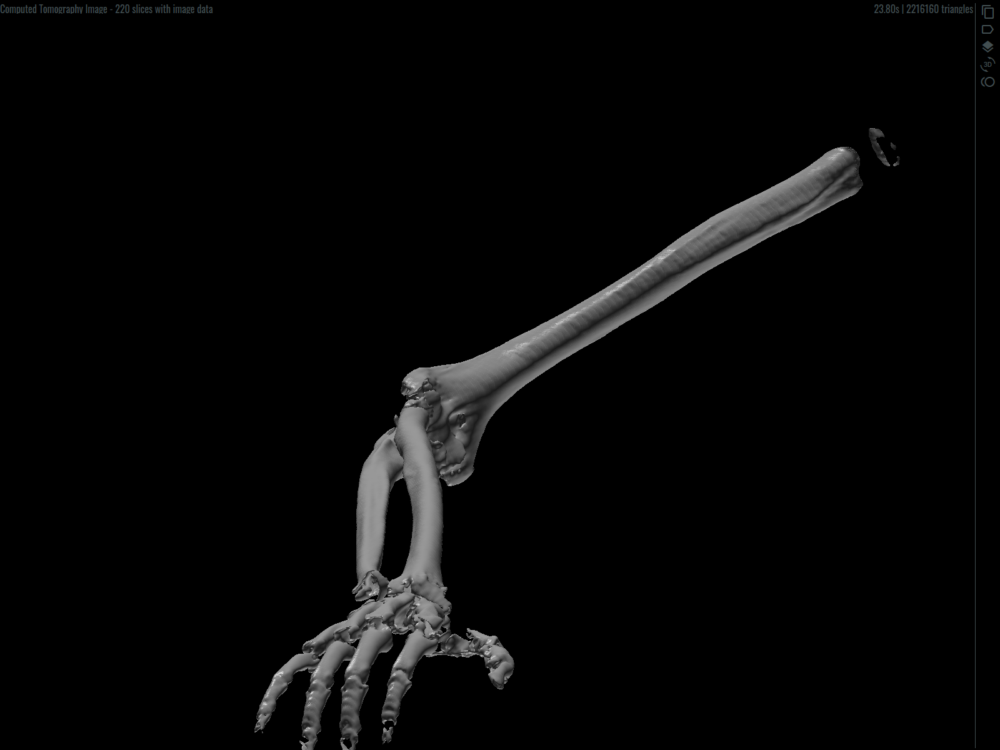

# Introduction

ReConstruct is an WPF / F# application that renders 3D reconstructions from Radiology scans.
Radiology scans contain series of 2D images (slices) that are essentially clouds or points or scalar fields.
Iso surfaces representing tissue can be extracted from a set of slices and different iso values can be used to filter different types of tissue.
This is an oversimplification of course, the actual process is much more nuanced.
Medical 3D volume reconstruction in general has inherent difficulties derived from interpreting datasets correctly and removing noise up to an acceptable threshold. 

Eventually this project should evolve into an application for 3D reconstructions from any source of scalar field data, not just Radiology scans.
Scalar field analysis is widely used in many areas of Science and Engineering.

# Iso surface calculation

An Iso Surface is the geometrical place of points with a specific value in a scalar field.
It can be approximated by extracting an analytical function that represents it or by calculating a discrete mesh.
The discrete mesh approach is the most common, some of its challenges are, 

- generating a mesh that is topologically correct,
- achieving both acceptable performance and quality of the mesh.

The reconstruction algorithms in this project are based conceptually in well known 3D reconstruction techniques.
The main implementations are optimized for performance using parallel processing, SIMD, mem tweaks, etc. 
Memory management needs an overhaul, the plan is moving to .NET Core and to leverage all the memory goodness it offers.

# Rendering

The graphics pipeline is decoupled, its main blocks are imaging dataset processing, geometry calculation and rendering.
The render backend is OpenGL at the moment, with a small wrapper so it can be swapped.
In particular I would like to integrate it with at least another backend. Vulkan would be ideal, if I can get the bindings working. 
Failing this, DirectX will do though it is a less interesting choice.

# UI Design

The application is written in F# including the WPF front end.
An MVC pattern is used instead of MVVM, this is an experiment on alternatives to MVVM.
In this case, F# and MVC are a good match since MVC is immutable by default and fits well in a Funcional Programming approach.

Styling is done in XAML but Views are built with code instead of XAML. 
Admittedly, this goes against the grain of WPF but there is a rationale behind,

- It allows binding Models to Views statically. Data bindings are checked in compile time so broken bindings do not happen.
- It offers a lot of flexibility and control when creating Views.
- Views can be written this way just as fast as XAML or even faster.
- In my opinion, MVC provides enforces separation of concerns better than MVVM.
- I have not used this pattern in big projects yet but I believe it scales well.

# Credits

Many thanks to the creators of,

- Oswald Font https://github.com/googlefonts/OswaldFont
- Material Design Iconic Font http://zavoloklom.github.io/material-design-iconic-font/license.html

Both fonts are available under the SIL Open Font License (OFL) http://scripts.sil.org/OFL
